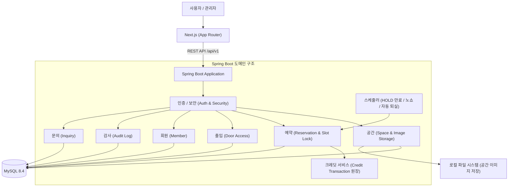
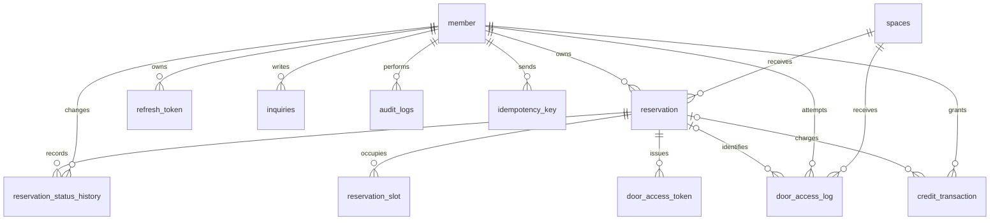
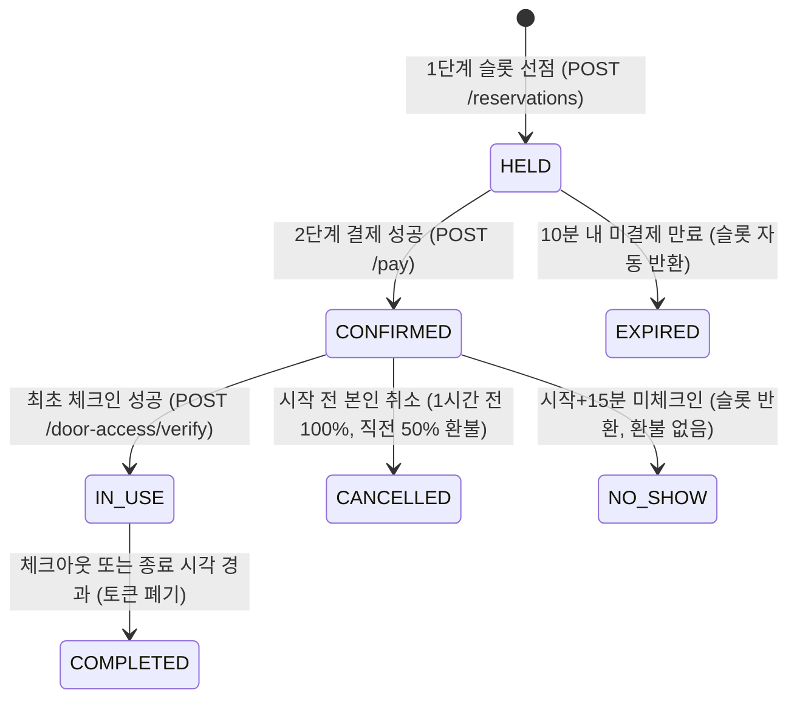

# 🔑 Slot Key

> 시간을 Slot으로 나누고, 예약한 Slot이 하나의 Key가 된다.

**Slot Key**는 회의실·공유오피스를 30분 단위로 예약하고, 예약 상태와 이용 시간에 따라 출입 권한을 제공하는 서비스입니다.

주요 도입 고객은 **다수의 오피스 계열 건물을 보유한 건물주**이고, 공간을 찾아 예약하는 회원은 최종 이용자입니다. 건물주에게는 공간과 예약을 운영할 수 있는 백오피스 수단을, 이용자에게는 공간 탐색부터 예약·이용까지 이어지는 흐름을 제공하려는 방향입니다. 현재 구현은 단일 관리자 백오피스로 동작하며, 건물주별 관리 분리 기능은 아직 구현되지 않은 과제입니다([서비스 대상과 가치 가설](docs/requirements.md#서비스-대상과-가치-가설) 참고).

예약은 슬롯 확보(HOLD, 10분)와 결제 확인 두 단계로 처리하고, 출입 요청마다 **회원 식별·예약 소유권·예약 상태·출입 키 활성 여부와 이용 시간**을 확인합니다. 이번 프로젝트는 동시 예약 방지, 트랜잭션 정합성, 역할·소유권·상태·시간을 조합한 인가를 구현하고 검증하는 데 집중합니다.

> 현재 개발 및 테스트 정합화가 완료된 프로젝트입니다. 클라우드 운영 환경 배포 실측 및 E2E 브라우저 자동화는 추후 과제로 관리합니다.

| 항목 | 내용 |
| --- | --- |
| 팀 | 05팀 · 오벤져스 |
| 과정 | 백엔드 데브코스 12기 14회차 |
| 개발 기간 | 2026.09.14 ~ 2026.10.01 |
| 서비스 URL | AWS 인프라 배포 설계 완료 (실제 운영 클라우드 배포 실측은 미검증) |
| API 문서 | 로컬 서버 기동 시 `http://localhost:8080/swagger-ui/index.html` 접근 가능 (자동화 테스트 통과) |
| 시연 영상 | 별도 제공 예정 |

## 📋 목차

1. [🎯 프로젝트 목표](#-프로젝트-목표)
2. [🧩 주요 기능](#-주요-기능)
3. [🛠️ 기술 스택](#️-기술-스택)
4. [🏗️ 시스템 아키텍처](#️-시스템-아키텍처)
5. [🗂️ 데이터 모델](#️-데이터-모델)
6. [📐 핵심 설계](#-핵심-설계)
7. [🔐 인증 및 인가](#-인증-및-인가)
8. [📡 API 개요](#-api-개요)
9. [🧪 테스트 전략 및 결과](#-테스트-전략-및-결과)
10. [🚀 프로젝트 구조 및 실행](#-프로젝트-구조-및-실행)
11. [🤝 협업 규칙](#-협업-규칙)
12. [👥 팀원 및 역할](#-팀원-및-역할)
13. [✅ Definition of Done](#-definition-of-done)
14. [📝 기술적 의사결정 문서](#-기술적-의사결정-문서)

## 🎯 프로젝트 목표

### 동시 예약 방지

예약 가능 시간을 조회한 이후 다른 사용자가 먼저 예약할 수 있습니다. 화면의 예약 가능 여부와 별개로, 서버가 슬롯을 선점(HOLD)하거나 결제를 확정하는 시점에 동일 공간의 겹치는 슬롯 점유를 DB 유니크 제약과 비관적 락으로 원천 차단합니다.

### 예약과 결제의 일관성

예약 확정 과정에서 일부 작업만 성공하면 예약과 크레딧 잔액이 달라질 수 있습니다. 슬롯 확보(HOLD 생성)와 결제 확정(크레딧 차감 + `CONFIRMED` 전이)을 각각 독립된 트랜잭션으로 관리하여 부분 실패 시 해당 단계의 변경 내용만 롤백합니다. 결제 실패 시에도 예약 자체는 `HOLD`로 남아 10분 만료 전까지 재시도할 수 있습니다.

### 예약 상태와 출입 권한의 일치

출입 키가 남아 있더라도 예약이 취소되거나 이용 시간이 종료되면 출입할 수 없어야 합니다. 출입 검증 시 회원 식별, 예약 소유권 및 상태(`CONFIRMED`/`IN_USE`), 출입 키 활성 여부와 허용 시간대를 종합 판단하며, 체크아웃 시 즉시 토큰을 폐기합니다.

### 역할과 소유권의 분리

관리자는 공간과 회원을 관리하고 전체 예약을 조회합니다. 관리자라도 타인 명의로 출입 키를 발급받거나 임의로 일반 예약을 직접 취소할 수 없으며, 불가피한 경우 사유와 함께 강제 취소(`force-cancel`) API 및 감사 로그를 통해 처리합니다.

## 🧩 주요 기능

| 영역 | 기능 |
| --- | --- |
| 회원 | 이메일·비밀번호 기반 회원가입(가입 크레딧 자동 지급), 로그인/로그아웃, 토큰 재발급, 본인 정보 조회 |
| 공간 | 공간 목록(지역/가격/시간 필터 지원)·상세 조회, 날짜별 30분 단위 예약 가능 시간 확인, 공개 공간 사진 조회 |
| 예약 | 30분 단위 예약(HOLD → 결제 확정), 본인 예약 조회·취소·연장, 체크아웃(이용 완료) |
| 출입 | 예약 기반 출입 키 발급·재발급·폐기, 모의 출입 검증(최초 체크인 및 재입장 판정), 출입 기록 조회 |
| 관리자 | 대시보드 현황(서울 기준 활성 예약 및 통계), 공간 등록·수정 및 대표 사진 업로드(5MB), 전체 회원 조회·정지·복구 및 크레딧 지급, 전체 예약 조회 및 사유 기반 강제 취소, 감사 로그 조회 |
| 문의 | 회원 1:1 문의 작성·목록·상세·수정(답변 전), 관리자 전체 문의 목록·상세 및 답변 등록 |
| 이력 | 예약 상태 전이 이력, 출입 시도 로그, 관리자 행위 감사 로그 기록 |

### 서비스 이용 흐름

#### 1. 일반 사용자 (USER)
1. **회원가입 및 로그인**: 회원가입 시 기본 크레딧 자동 지급, 로그인 후 JWT 발급
2. **공간 탐색 및 선택**: 지역/가격/이용 시간대 필터로 공간 조회, 날짜별 30분 슬롯 가용성 확인
3. **슬롯 임시 확보 (HOLD)**: 원하는 슬롯을 선택하여 예약 생성 요청 (`POST /reservations`), 10분간 슬롯 선점
4. **결제 확인 및 확정**: `Idempotency-Key` 헤더와 함께 결제 요청 (`POST /reservations/{id}/pay`), 크레딧 차감 후 `CONFIRMED` 전이
5. **출입 키 발급**: 예약 확정 직후 출입 키 발급 (`POST /reservations/{id}/door-token`), 브라우저 로컬 저장소 보관
6. **모의 출입 검증 (최초 체크인)**: 예약 시작 15분 이내에 출입 검증 (`POST /door-access/verify`), 문 개방과 함께 `IN_USE` 전이
7. **이용 및 연장/체크아웃**: 필요 시 뒤 슬롯 연장, 이용 종료 시 체크아웃 (`POST /reservations/{id}/check-out`)
8. **1:1 문의**: 이용 중 문의 사항 등록 (`POST /inquiries`) 및 답변 확인

#### 2. 관리자 (ADMIN)
1. **관리자 로그인**: 사전 등록된 관리자 계정(`admin000@sample.com`)으로 로그인
2. **대시보드 모니터링**: 당일 서울 기준 활성 예약 건수, 신규 예약, 공간 통계 확인
3. **공간 관리**: 신규 공간 등록 (`POST /admin/spaces`), 운영시간/요금/상태 수정 (`PATCH /admin/spaces/{id}`), 대표 사진 파일 업로드 (`PUT /admin/spaces/{id}/image`)
4. **회원 관리**: 회원 목록 조회, 악성 회원 계정 정지(`suspend`)/복구(`restore`), 필요 시 크레딧 수동 지급 (`POST /admin/members/{id}/credits`)
5. **예약 관리**: 전체 회원 예약 목록 및 상태 이력 조회, 불가피한 사유 발생 시 사유 입력 후 강제 취소 (`POST /admin/reservations/{id}/force-cancel`)
6. **감사 로그 추적**: 관리자 작업(공간 수정, 회원 정지, 크레딧 지급, 강제 취소 등)에 대한 페이징 감사 로그 API 제공 (`GET /admin/audit-logs`) ※ 백엔드 API 제공 범위이며 별도 프론트엔드 관리자 UI 조회 화면은 미구현
7. **1:1 문의 응대**: 접수된 사용자 문의 목록 확인 및 관리자 답변 등록 (`POST /admin/inquiries/{id}/answer`)

### 구현 범위에서 제외한 기능

- 실제 PG(Payment Gateway) 결제 및 스마트락 하드웨어 연동 — 내부 크레딧 잔액 차감 및 모의 출입 API로 대체
- 셀프 크레딧 충전 기능 (회원가입 기본 지급 및 관리자 수동 지급으로만 크레딧 증액)
- 비동기 PG 콜백 (크레딧 차감은 동기적 단일 트랜잭션으로 즉시 처리)
- 다중 건물주별 격리 관리 기능 (현재는 단일 백오피스 관리자 체계)
- 팀 리더의 대리 예약과 대리 취소, 관리자의 타인 예약 일반 대리 취소/출입 키 발급
- 회원 등급, 멤버십, 쿠폰, 할인 등 동적 요금 정책
- 예약 시간대 이동(변경) — 기존 예약 취소 후 신규 예약 흐름으로 처리 (연장은 뒷 슬롯 확장이므로 지원)
- 예약 대기(대기번호) 및 자동 승격, 점검 시간 블록, 크레딧 회수
- 패스키/QR 물리 출입 단말 연동, 소셜 로그인, 모바일 네이티브 앱

## 🛠️ 기술 스택

| 영역 | 기술 | 사용 목적 및 버전 |
| --- | --- | --- |
| Backend | Spring Boot 3.3.4, Java 21 | RESTful API 서비스 및 도메인 비즈니스 로직 구성 |
| Security | Spring Security 6.3, JJWT 0.12.6 | 무상태 JWT 인증 및 RBAC 인가 제어 (BCrypt 암호화) |
| Persistence | Spring Data JPA, Hibernate 6.5, Flyway 10.15 | 데이터 영속성 관리 및 버전 기반 DB 마이그레이션 (`ddl-auto: none`) |
| Database | MySQL 8.4 (utf8mb4) | 회원, 공간, 예약, 슬롯, 원장, 토큰, 감사 로그 저장 |
| Test | JUnit 5, Mockito, Testcontainers MySQL | 단위 테스트 및 실제 MySQL 컨테이너 기반 다중 트랜잭션 통합/동시성 테스트 |
| Frontend | Next.js 16 (App Router), React 19, TypeScript | 반응형 웹 UI, 정적 export 호스팅 및 로컬 개발용 API 프록시 |
| Styling | Tailwind CSS, CSS Custom Properties | 디자인 토큰 기반 반응형 스타일링 |
| API Docs | Springdoc OpenAPI 2.6.0, Swagger UI | REST API 자동 문서화 및 대화형 API 탐색 (`/swagger-ui/index.html`) |
| Deployment | AWS EC2 + RDS + S3/CloudFront | 클라우드 인프라 배포 아키텍처 설계 (실제 운영 배포 실측은 미실시) |

## 🏗️ 시스템 아키텍처

Slot Key는 단일 Spring Boot 백엔드 애플리케이션 내에서 도메인 책임을 명확히 분리하고, Next.js 프론트엔드와 REST API로 통신합니다.



- **예약 도메인**: 2단계 예약(HOLD → 결제 확정)과 슬롯 점유를 조율하며, 취소·연장·체크아웃을 관리합니다.
- **출입 도메인**: 회원, 예약, 토큰 유효성, 시간대 조건을 종합하여 출입 허용 여부를 판정하고 이력을 기록합니다.
- **크레딧 서비스**: 실제 외부 결제 없이 `credit_transaction` 원장 테이블을 통해 잔액 차감과 환급의 데이터 무결성을 보장합니다.
- **감사 도메인**: 공간 정보 변경, 회원 상태 변경, 관리자 강제 취소, 크레딧 수동 지급 등 관리자 작업을 독립적으로 기록합니다.
- **스케줄러**: 만료된 HELD 예약 정리, 노쇼 판정, 종료 시각 경과 이용의 자동 완료(퇴실) 처리를 비동기로 보조합니다.

## 🗂️ 데이터 모델

### 주요 엔터티

| 엔터티 / 테이블 | 역할 |
| --- | --- |
| `member` | 회원의 로그인 정보, 역할(`USER`, `ADMIN`), 현재 계정 상태(`ACTIVE`, `SUSPENDED`, `WITHDRAWN`), 잔액(`balance`) 관리 |
| `spaces` | 공간 정보, 운영시간, 수용 인원, 시간당 요금, 상태(`ACTIVE`, `INACTIVE`), 대표 사진 경로(`image_path`), 낙관적 버전 관리 |
| `reservation` | 예약자, 공간, 이용 시간, 요금 스냅샷, 확정 금액, 예약 상태(HOLD 포함 7단계) 관리 |
| `reservation_slot` | 예약이 점유한 30분 단위 슬롯과 중복 예약 방지 (`UNIQUE(space_id, slot_start)`) |
| `reservation_status_history` | 예약 생성·결제·취소·연장·노쇼·완료에 따른 상태 전이 이력 관리 |
| `credit_transaction` | 회원별 크레딧 지급·차감·환급 원장(부호 있는 금액, `payment` 테이블 대체) 관리 |
| `door_access_token` | 예약에 따른 출입 토큰 발급·폐기 이력 관리 (`UNIQUE(active_reservation_id)`) |
| `door_access_log` | 모든 출입 허용·거절 결과(`ALLOW`, `DENY`)와 사유 코드 기록 |
| `refresh_token` | 로그인 연장 토큰의 발급, 만료, 폐기 관리 |
| `audit_logs` | 공간 수정, 회원 정지/복구, 관리자 강제 취소, 크레딧 수동 지급 등 관리자 작업 기록 |
| `idempotency_key` | 결제 확정(`POST /reservations/{id}/pay`) 요청의 중복 처리 방지 및 멱등 응답 캐싱 (V7) |
| `inquiries` | 사용자 1:1 문의 및 관리자 단일 답변(`WAITING`, `ANSWERED`) 관리 (V10) |



출입 토큰이 유효하지 않아 예약을 식별할 수 없는 경우를 고려해 `door_access_log.reservation_id`는 `NULL`을 허용합니다. `door_access_token`은 `active_reservation_id`(폐기되지 않은 토큰만 값을 가지는 생성 컬럼)에 `UNIQUE` 제약을 적용해, 예약당 활성 토큰이 최대 1개가 되도록 DB 레벨에서 강제합니다.

### 예약 시점 정보 보존 및 필드 구분

| 필드 / 테이블 | 위치 | 목적 및 관리 상태 |
| --- | --- | --- |
| `price_per_slot_snapshot` | `reservation` | 예약 확정 당시의 30분당 요금 보존 (공간 가격 변경 후에도 기존 예약 금액 불변) |
| `total_amount` | `reservation` | 확정된 총 결제 금액 보존 |
| `created_at` | `reservation` | 예약 생성(HOLD) 시각 기록 |
| `idempotency_key` | `idempotency_key` | 별도 독립 테이블로 분리되어 결제 멱등성 보장 (`reservation` 테이블의 컬럼이 아님) |
| `termsVersion` | 미저장 (결정 필요) | 프론트엔드가 예약 요청 시 전송(`'v1.1'`)하나 서버 DTO/DDL에는 미저장 상태로 향후 과제 관리 |

공간 요금이 변경되더라도 기존 예약의 `price_per_slot_snapshot`과 `total_amount`는 변경되지 않습니다. 상세 DDL 및 스키마 구조는 [docs/erd.md](docs/erd.md)를 참고합니다.

## 📐 핵심 설계

### 예약 시간과 요금

- 예약은 같은 날짜의 공간 운영시간 안에서 생성합니다.
- 시작·종료 시각은 30분 단위로 제한합니다.
- 종료 시각은 시작 시각보다 늦어야 합니다 (`startTime < endTime`).
- 과거 시간과 다른 예약이 이미 점유한 시간은 예약할 수 없습니다.
- 모든 회원에게 공간별 고정 시간당 요금을 동일하게 적용합니다.
- 최종 결제 금액은 클라이언트가 아닌 서버에서 계산합니다.

```
총 결제 금액 = 예약 당시 30분당 요금(price_per_slot_snapshot) × 점유 슬롯 수

예시: 30분당 요금 5,000원 × 슬롯 2개(60분 이용) = 10,000원
```

### 예약 생성 및 결제 (2단계 분리)

예약 생성과 결제는 독립된 트랜잭션으로 처리합니다.

```
[1단계] POST /api/v1/reservations (슬롯 선점, 결제 없음)
  → 공간 운영시간 및 30분 경계 검증
  → 대상 슬롯의 만료된 HELD 자동 정리
  → 슬롯 유니크 INSERT (충돌 시 409 RESERVATION_SLOT_CONFLICT)
  → HELD 예약 생성 (10분 만료 시각 holdExpiresAt 설정)

[2단계] POST /api/v1/reservations/{id}/pay (결제 확정, Idempotency-Key 필수)
  → 예약 소유권 선검증
  → Space 비관적 공유 락(PESSIMISTIC_READ) 및 space.version 일치 검증
  → 크레딧 잔액 확인 및 차감 (원장 INSERT + 잔액 UPDATE)
  → 조건부 CONFIRMED 상태 전이 (성공 시 200 OK 응답 캐싱)
```

1단계에서 슬롯 확보가 실패하면 전체 롤백되고, 2단계에서 크레딧 잔액 부족 등으로 실패하면 결제 트랜잭션만 롤백되어 예약은 `HELD`로 남아 10분 만료 전까지 재시도할 수 있습니다. 자세한 동시성 및 잠금 규칙은 [docs/decisions/reservation-concurrency.md](docs/decisions/reservation-concurrency.md)에 기술되어 있습니다.

### 요청 멱등성

결제 확정 요청(`POST /api/v1/reservations/{id}/pay`)에는 `Idempotency-Key` 헤더가 필수입니다. 슬롯만 확보하는 `POST /reservations`(HOLD 생성)는 결제가 없으므로 대상이 아닙니다.

- 멱등 키의 적용 범위(Scope)는 `(idempotency_key, member_id, request_path)` 유니크 제약으로 관리됩니다 (`request_path`에 `reservationId`가 포함됨).
- 동일 회원이 동일 예약 경로에 동일한 멱등 키로 이미 성공(200 OK)한 요청을 재전송하면, 결제 및 상태 전이를 재실행하지 않고 캐시된 200 성공 응답을 그대로 반환합니다.
- 동일 키로 완전히 동시에 결제 확정 요청이 경합하면, DB의 조건부 UPDATE(`confirmIfHeldAndNotExpired`)에 의해 1건만 성공하고 밀린 요청은 `409 RESERVATION_STATE_CONFLICT`를 반환받습니다. 이후 동일 키로 재요청 시 먼저 저장된 200 OK 응답을 재생받습니다.
- 결제가 실패(잔액 부족 등)한 경우에는 트랜잭션이 롤백되어 멱등 레코드가 저장되지 않으므로, 동일 키로 결제를 재시도할 수 있습니다.
- 동일 키로 상이한 요청 본문(파라미터 변조)을 전송했을 때의 본문 비교 감지 방식 및 오류 정책은 현재 구현되어 있지 않으며 향후 과제([docs/api-spec.md](docs/api-spec.md))로 관리합니다.
- 상세 규칙은 [docs/decisions/reservation-idempotency.md](docs/decisions/reservation-idempotency.md)를 참고합니다.

### 예약 상태 전이



- 슬롯 확보에 성공하면 `HELD`로 생성되고, 결제(크레딧 차감)에 성공하면 `CONFIRMED`로 전이합니다.
- `HELD`는 10분 내 결제하지 않으면 `EXPIRED`로 전이하고 슬롯을 반환합니다.
- 예약 시작 전의 `CONFIRMED` 예약만 일반 취소할 수 있으며(1시간 전까지 100%, 그 이후~시작 전 50% 환불), 시작 이후는 체크아웃으로만 종료합니다.
- 시작 후 15분까지 체크인하지 않으면 스케줄러에 의해 `NO_SHOW`로 전이되고 슬롯은 반환되나 환불은 없습니다.
- `EXPIRED`, `CANCELLED`, `COMPLETED`, `NO_SHOW`는 종단 상태이며 되돌아가지 않습니다.

### 출입 키 정책

- 예약 상태가 `CONFIRMED` 또는 `IN_USE`이고 아직 종료되지 않은 경우(`now < endTime`) 예약자 본인에게 출입 키를 발급합니다. **발급 자체에는 시간 제한이 없습니다**(확정 직후부터 종료 전까지 언제든 발급/재발급 가능).
- 원문 토큰은 발급 응답에서 단 한 번만 제공되며 서버 DB에는 일방향 해시(`token_hash`)만 저장됩니다.
- **프론트엔드 노출 정책**: 발급받은 원문 토큰은 브라우저 로컬 저장소(`localStorage`)에 저장하여 재방문 시 마이페이지 및 예약 상세 화면에 표시합니다. 취소나 체크아웃 시에는 로컬 저장소에서 삭제됩니다.
- 재발급 시 기존 활성 토큰은 즉시 폐기(`revoked_at` 설정)됩니다.
- **최초 체크인 구간**: `[시작 시각, 시작 시각 + 15분]` (앞 여유 0분 — 시작 시각 정각부터 입장 가능). 최초 체크인 성공 시 부수 효과로 `CONFIRMED → IN_USE`로 전이됩니다.
- **재입장 구간**: `(최초 체크인 시각, 종료 시각)` (종료 정각은 퇴실 완료 시점이므로 거절).
- **체크아웃**: 이용 종료 시 `POST /reservations/{id}/check-out` 호출로 마감하며 활성 토큰이 즉시 폐기됩니다.
- 상세 규칙은 [docs/decisions/access-key-policy.md](docs/decisions/access-key-policy.md)를 참고합니다.

### 공간 운영 상태

| 상태 | 의미 |
| --- | --- |
| `ACTIVE` | 정상 운영, 신규 예약 가능 |
| `INACTIVE` | 점검 또는 비운영, 신규 예약 불가 (기존 확정 예약은 유지) |

공간 운영시간을 축소할 때 현재 이후의 유효 점유 슬롯(`HELD`, `CONFIRMED`, `IN_USE`, `COMPLETED`) 중 새 운영시간을 벗어나는 슬롯이 존재하면 `SPACE_OPERATING_HOURS_CONFLICT`(409)로 수정을 거절하며, 공간을 `INACTIVE`로 변경해도 이미 확정된 예약은 유지됩니다.

## 🔐 인증 및 인가

Access JWT 페이로드에 포함된 `id`, `email`, `role`, 만료 시각을 검증하여 인증하며, 보호 API 요청마다 회원 DB를 재조회하지 않습니다. 예약 관련 작업에서는 예약 소유권과 상태를 서비스 레이어에서 추가로 검사합니다.

| 작업 | 비회원 | 회원 (USER) | 관리자 (ADMIN) |
| --- | --- | --- | --- |
| 공간 및 슬롯 조회 | 가능 | 가능 | 가능 |
| 본인 예약 생성·조회·취소·연장·체크아웃 | 불가 | 가능 | 동일한 예약자 정책 적용 |
| 타인 예약 조회 | 불가 | 불가 | 관리자 예약 조회 API에서 가능 |
| 타인 예약 취소 | 불가 | 불가 | 불가 (관리자 강제 취소 `force-cancel` 별도) |
| 출입 키 발급·재발급 | 불가 | 본인 예약만 | 본인 예약만 (관리자 대리 발급 불가) |
| 공간 등록·수정·대표사진 업로드 | 불가 | 불가 | 가능 |
| 일반 회원 정지·복구·크레딧 수동 지급 | 불가 | 불가 | 가능 (본인에게 지급 불가) |
| 관리자 감사 로그 조회 | 불가 | 불가 | 가능 |
| 1:1 문의 작성·조회·수정 | 불가 | 본인 문의만 | 관리자 전체 조회 및 답변 등록 |

### 보안 원칙

- 계정 정지는 기존 예약과 결제를 자동 취소하지 않습니다.
- 계정이 정지(`SUSPENDED`)되어도 기존 Access Token은 만료 전까지 유효하지만, 토큰 재발급(`POST /api/v1/auth/refresh`) 시 회원 DB 조회를 거쳐 `ACCOUNT_INACTIVE`(403)로 차단됩니다 (Access Token 즉시 차단은 추후 과제).
- 회원가입 요청으로 관리자 역할을 지정할 수 없도록 합니다.
- 일반 회원의 타인 예약 접근은 `FORBIDDEN_NOT_OWNER`(403)로 차단하고, 존재하지 않는 예약 접근은 `RESERVATION_NOT_FOUND`(404)로 처리합니다.
- 관리자 계정 정지와 역할 변경은 MVP 범위에서 제외합니다.
- 화면에서 버튼을 숨기는 것과 별개로 서버에서 권한을 검사합니다.
- 비밀번호는 BCrypt로 해시하여 저장합니다.
- 비밀번호, JWT, Authorization 헤더, 출입 키 원문은 로그에 기록하지 않습니다.
- 배포 자격증명과 서명 키는 환경변수 또는 GitHub Secrets로 관리합니다.

## 📡 API 개요

**Base URL:** `/api/v1`

인증이 필요한 API는 다음 헤더를 사용합니다. 로그인 시 발급된 Refresh Token은 HttpOnly 쿠키(`Path=/api/v1/auth`, `maxAge=1일`)로 관리되며, 토큰 재발급·로그아웃 요청 시 쿠키로 자동 전달됩니다.

```
Authorization: Bearer {accessToken}
```

아래 목록은 현재 컨트롤러에 구현된 40개 전체 엔드포인트입니다 (Base URL 제외).

| 영역 | Method | Endpoint | 설명 |
| --- | --- | --- | --- |
| 인증 | `POST` | `/auth/signup` | 회원가입 및 기본 크레딧 자동 지급 |
| 인증 | `POST` | `/auth/login` | 로그인 (Access Token 본문, Refresh Token 쿠키 반환) |
| 인증 | `POST` | `/auth/refresh` | 토큰 재발급 (Refresh Token 쿠키 검증 후 새 Access Token 발급) |
| 인증 | `POST` | `/auth/logout` | 로그아웃 (Refresh Token DB 폐기 및 쿠키 만료) |
| 회원 | `GET` | `/members/me` | 본인 정보 및 크레딧 잔액 조회 |
| 공간 | `GET` | `/spaces` | 공간 목록 조회 (지역, 가격, 시간대 필터 지원) |
| 공간 | `GET` | `/spaces/{spaceId}` | 공간 상세 정보 조회 |
| 공간 | `GET` | `/spaces/{spaceId}/slots` | 날짜별 30분 단위 예약 가능 슬롯 조회 |
| 공간 | `GET` | `/space-images/{fileName}` | 업로드된 공간 대표 사진 정적 조회 |
| 예약 | `POST` | `/reservations` | 1단계 예약 생성 (슬롯 선점, HOLD) |
| 예약 | `POST` | `/reservations/{reservationId}/pay` | 2단계 결제 확인 및 확정 (`Idempotency-Key` 필수) |
| 예약 | `GET` | `/reservations` | 본인 예약 목록 조회 |
| 예약 | `GET` | `/reservations/{reservationId}` | 본인 예약 상세 조회 |
| 예약 | `POST` | `/reservations/{reservationId}/cancel` | 본인 예약 일반 취소 (시작 전 환불 정책 적용) |
| 예약 | `POST` | `/reservations/{reservationId}/extend` | 본인 예약 슬롯 연장 (뒷 슬롯 추가 결제) |
| 예약 | `POST` | `/reservations/{reservationId}/check-out` | 체크아웃 (이용 완료 처리, 토큰 폐기) |
| 출입 | `POST` | `/reservations/{reservationId}/door-token` | 출입 토큰 발급 및 재발급 |
| 출입 | `PATCH` | `/reservations/{reservationId}/access-token/revoke` | 활성 출입 토큰 즉시 폐기 |
| 출입 | `GET` | `/reservations/{reservationId}/access-logs` | 본인 예약 출입 시도 기록 조회 |
| 출입 | `POST` | `/door-access/verify` | 모의 출입 검증 (최초 체크인 및 재입장 판정) |
| 관리자 | `GET` | `/admin/spaces` | 관리자 전체 공간 목록 조회 |
| 관리자 | `POST` | `/admin/spaces` | 신규 공간 등록 |
| 관리자 | `GET` | `/admin/spaces/{spaceId}` | 공간 정보 수정용 상세 조회 |
| 관리자 | `PATCH` | `/admin/spaces/{spaceId}` | 공간 정보 부분 수정 (운영시간, 가격, 상태 등) |
| 관리자 | `PUT` | `/admin/spaces/{spaceId}/image` | 공간 대표 사진 업로드 (5MB 이하 JPEG/PNG) |
| 관리자 | `GET` | `/admin/reservations` | 관리자 전체 회원 예약 목록 페이징 조회 |
| 관리자 | `GET` | `/admin/reservations/{reservationId}` | 관리자 예약 상세 및 출입 이력 조회 |
| 관리자 | `POST` | `/admin/reservations/{reservationId}/force-cancel` | 사유를 기록한 예약 강제 취소 (전액 환불) |
| 관리자 | `GET` | `/admin/members` | 전체 회원 목록 조회 |
| 관리자 | `PATCH` | `/admin/members/{memberId}/suspend` | 일반 회원 계정 정지 (사유 필수) |
| 관리자 | `PATCH` | `/admin/members/{memberId}/restore` | 정지 회원 계정 정상 복구 |
| 관리자 | `POST` | `/admin/members/{memberId}/credits` | 회원 크레딧 수동 지급 (본인 지급 불가) |
| 관리자 | `GET` | `/admin/audit-logs` | 관리자 행위 감사 로그 페이징 조회 |
| 문의 | `POST` | `/inquiries` | 회원 1:1 문의 작성 |
| 문의 | `GET` | `/inquiries` | 본인 1:1 문의 목록 페이징 조회 |
| 문의 | `GET` | `/inquiries/{inquiryId}` | 본인 1:1 문의 상세 조회 |
| 문의 | `PATCH` | `/inquiries/{inquiryId}` | 본인 1:1 문의 수정 (답변 대기 상태만) |
| 관리자 | `GET` | `/admin/inquiries` | 관리자 전체 문의 목록 조회 |
| 관리자 | `GET` | `/admin/inquiries/{inquiryId}` | 관리자 문의 상세 조회 |
| 관리자 | `POST` | `/admin/inquiries/{inquiryId}/answer` | 관리자 문의 답변 등록 |

- 공간 및 슬롯 조회는 비로그인 상태에서도 가능합니다.
- 결제 확정(`/pay`) 요청에는 중복 처리를 방지하는 `Idempotency-Key` 헤더가 필수입니다.
- 본인 예약 조회·취소·연장·출입 토큰 발급·체크아웃은 예약자 본인만 가능합니다.
- 관리자 강제 취소는 별도 관리자 API에서 사유와 감사 로그를 기록하여 처리합니다.
- 상세 요청·응답 규격과 오류 코드는 [docs/api-spec.md](docs/api-spec.md) 및 Swagger UI(`/swagger-ui/index.html`)에서 확인하실 수 있습니다.

### 🧪 테스트 전략 및 결과

정상 흐름뿐 아니라 동시 요청 경합, 부분 실패 롤백, 상태 전이 무결성 및 시간 경계를 엄격히 검증합니다.

| 계층 | 사용 도구 | 검증 대상 및 실측 결과 |
| --- | --- | --- |
| 백엔드 단위·통합 테스트 | JUnit 5, Mockito, Testcontainers MySQL 8.4 | 도메인 단위 로직, 트랜잭션 전파, DB 유니크 제약, 비관적 락 동시성, 다중 스레드 멱등성 검증<br>👉 **57개 테스트 클래스 / 354개 테스트 전원 통과** (실패 0, 에러 0, 스킵 0) |
| 프론트엔드 단위 테스트 | Node.js Test Runner (`node --test`) | API 클라이언트 에러 처리, 출입 키 저장/파싱, 유효성 검사 등<br>👉 **14개 테스트 전원 통과** (pass 14, fail 0) |
| 정적 분석 및 컴파일 | ESLint, TypeScript (`tsc`) | 프론트엔드 린트 및 타입 무결성 검증 통과 (`npm run lint`, `npx tsc --noEmit`) |
| API 문서 자동 검증 | MockMvc, Springdoc OpenAPI | Swagger UI 경로 및 OpenAPI 사양 생성 자동 검증 통과 (`/swagger-ui/index.html`) |
| 운영 배포 및 E2E 브라우저 | — | AWS 클라우드 배포 실측 및 E2E 브라우저 자동화는 추후 과제 |

시간 기반 로직에는 `Clock`을 주입하여 실제 대기 없이 시간대 경계 조건을 밀리초/나노초 단위로 정밀하게 검증합니다.

### 핵심 테스트 시나리오 매핑

| 대상 | 검증 내용 | 검증 테스트 클래스 |
| --- | --- | --- |
| 동시 예약 경합 | 동일 공간·슬롯에 다중 스레드 동시 요청 시 단 1건만 선점 성공하고 나머지는 409 충돌 처리 | `SpaceReservationLockIntegrationTest`, `ReservationConcurrencyTest` |
| 연장-예약 경합 | 이용 중 연장 요청과 타 회원의 신규 슬롯 선점이 경합할 때 원자적 잠금으로 단 1건만 승인 | `ReservationExtendIntegrationTest` |
| 만료-결제 경합 | 10분 만료 시점 직전/직후의 결제 시도 시 락 획득 후 만료 검증으로 일관성 유지 | `ReservationPaymentConcurrencyTest` |
| 요청 멱등성 | 동일한 `Idempotency-Key`로 결제를 재전송해도 크레딧이 1회만 차감되고 캐시된 200 응답 반환 | `ReservationIdempotencyIntegrationTest` |
| 결제 부분 실패 | 잔액 부족 등으로 결제 실패 시 결제만 롤백되고 예약은 `HELD`로 남아 10분 내 재시도 가능 | `ReservationPaymentIntegrationTest` |
| 요금 보존 | 공간의 시간당 요금이 변경되어도 기존 확정 예약의 스냅샷 요금 불변 | `ReservationPaymentIntegrationTest` |
| 계정 정지 | 계정이 정지된 회원의 토큰 재발급(refresh) 요청 시 `ACCOUNT_INACTIVE`(403) 즉시 차단 | `AuthControllerTest` |
| 출입 토큰 무효화 | 예약 취소, 재발급, 체크아웃 직후 기존 활성 토큰 폐기 및 출입 거절 | `DoorAccessControllerTest`, `DoorAccessServiceTest` |
| 시간 경계 검증 | 최초 체크인 허용 구간 `[시작, 시작+15분]`(앞 여유 0분) 및 재입장 `(체크인, 종료)` 엄격 판정 | `DoorAccessTimePolicyTest` |
| 소유권 및 인가 | 일반 회원/관리자 모두 타인 명의 예약 취소 불가, 관리자는 사유 동반 `force-cancel`만 가능 | `ReservationServiceTest`, `AdminReservationServiceTest` |
| 크레딧 원장 경합 | 회원 상태변경과 크레딧 증가 동시 경합 격리 검증 (전체 원장 SUM 불변식 DB 영속성 검증은 향후 과제) | `MemberCreditConcurrencyTest` |
| 감사 실패 시 롤백 | 관리자 감사 로그 저장 실패 시 비즈니스 변경(크레딧 지급 등)도 원자적 롤백 | `AuditLogServiceTransactionTest` |

상세한 테스트 전략과 전수 실행 결과 보고서는 [docs/test-strategy.md](docs/test-strategy.md) 및 [docs/test-results.md](docs/test-results.md)를 참고합니다.

## 🚀 프로젝트 구조 및 실행

### 저장소 구조

```
NBE12-14-2-OVENGERS/
├── backend/                # Spring Boot 3.3.4 백엔드 애플리케이션
│   ├── docker-compose.yml  # 로컬 개발용 MySQL 8.4 컨테이너 구성
│   └── ...
├── frontend/               # Next.js 16 (App Router) 프론트엔드 웹
├── data-setting/           # 샘플 데이터 시딩 및 이미지 설정 셸 스크립트
├── docs/                   # 요구사항, 아키텍처, ERD, API 명세 및 설계 결정 문서
├── .agents/                # 개발 에이전트 작업 가이드 및 이력
├── .github/                # GitHub Actions 워크플로우 및 템플릿
├── .gitignore
└── README.md
```

### 상세 설계 및 정책 문서 (`docs/`)

- [요구사항 정의서 (docs/requirements.md)](docs/requirements.md)
- [시스템 아키텍처 (docs/system-architecture.md)](docs/system-architecture.md)
- [데이터베이스 ERD (docs/erd.md)](docs/erd.md)
- [REST API 명세서 (docs/api-spec.md)](docs/api-spec.md)
- [핵심 도메인 설계 결정 (docs/core-domain-decisions.md)](docs/core-domain-decisions.md)
- [관리자 공간 대표 사진 안내 (docs/admin-space-image-upload.md)](docs/admin-space-image-upload.md)
- [프론트엔드 결제 연동 가이드 (docs/FRONTEND2_PAYMENT_API.md)](docs/FRONTEND2_PAYMENT_API.md)
- [UI 디자인 및 화면 흐름 결정 (docs/UI_DESIGN_DECISIONS.md)](docs/UI_DESIGN_DECISIONS.md)
- [예약 약관 및 취소/환불 규정 검토 (docs/booking-terms-review.md)](docs/booking-terms-review.md)
- [테스트 전략 문서 (docs/test-strategy.md)](docs/test-strategy.md)
- [테스트 실행 결과서 (docs/test-results.md)](docs/test-results.md)
- [트러블슈팅 가이드 (docs/troubleshooting.md)](docs/troubleshooting.md)
- [예약 동시성 제어 정책 (docs/decisions/reservation-concurrency.md)](docs/decisions/reservation-concurrency.md)
- [예약 결제 멱등성 정책 (docs/decisions/reservation-idempotency.md)](docs/decisions/reservation-idempotency.md)
- [출입 키 발급 및 검증 정책 (docs/decisions/access-key-policy.md)](docs/decisions/access-key-policy.md)
- [인가 정책 및 권한 분리 (docs/decisions/authorization-policy.md)](docs/decisions/authorization-policy.md)

### 로컬 개발 환경 실행 안내

모든 안내는 저장소 루트(`NBE12-14-2-OVENGERS/`)에서 출발하는 것을 기준으로 합니다.

#### 1. 사전 요구사항
- **Java**: JDK 21
- **Node.js**: v20.9.0 이상 (LTS 권장, Next.js 16 요구사항), npm
- **Docker & Docker Compose**: MySQL 8.4 컨테이너 실행용

#### 2. 환경변수 설정 및 로컬 MySQL 기동
`backend/docker-compose.yml`은 환경변수 `DB_PASSWORD`를 필수로 요구합니다. 예제 파일을 복사하여 `.env`를 준비하고 컨테이너를 기동합니다.

```bash
# 1) backend 디렉터리로 이동하여 .env 생성 (기존 .env 파일이 없을 때만 복사)
cd backend
cp -n .env.example .env

# .env.example에는 로컬 개발용 DB_PASSWORD=root 및 기본 JWT_SECRET_KEY가 이미 정의되어 있습니다.
# 필요한 경우 .env 파일을 열어 환경변수 값을 조정합니다.

# 2) MySQL 8.4 컨테이너 실행 후 루트로 복귀
docker compose up -d
cd ..
```
- 컨테이너명: `slotkey-mysql`
- 포트: `3306` (기본 계정: `root` / 비밀번호: `root`, 데이터베이스: `slotkey`)

#### 3. 백엔드 스키마 생성 및 1차 기동
`backend/build.gradle`에는 `.env` 자동 로딩 설정이 없으므로, 프로세스 기동 시 필수 환경변수인 `JWT_SECRET_KEY`를 직접 전달합니다.

```bash
cd backend
# 백엔드 서버 1차 기동 (Flyway V1~V10 자동 마이그레이션 수행)
JWT_SECRET_KEY='local-dev-only-secret-key-must-be-32bytes-or-longer' ./gradlew bootRun
```
- 백엔드 서버 포트: `8080`
- Swagger UI 접속 주소: `http://localhost:8080/swagger-ui/index.html`
- 백엔드가 1회 정상 기동되어 Flyway 마이그레이션이 완료되면, 샘플 데이터 설치를 위해 백엔드 프로세스를 종료(`Ctrl + C`)합니다 (MySQL 컨테이너는 실행 상태 유지).
```bash
cd ..
```

#### 4. 개발 샘플 데이터 적재 (권장)
Flyway 테이블 생성이 완료된 후 백엔드가 종료된 상태(MySQL만 실행 중인 상태)에서 저장소 루트 디렉터리에서 시딩 스크립트를 실행합니다 (`data-setting/README.md` 절차 준수).

```bash
# 저장소 루트에서 실행 (회원 100명, 관리자 1명, 공간 39개 및 대표 사진 자동 적재)
bash data-setting/setup.sh setup
```
- **관리자 계정**: `admin000@sample.com` / `00000000`
- **일반 회원 계정**: `user001@sample.com` ~ `user100@sample.com` / `00000000` (샘플 계정당 1,000,000 크레딧 및 `SIGNUP_GRANT` 원장 보유)
- ※ 참고: 신규 회원가입 시 기본 지급되는 크레딧은 `50,000` 크레딧(`application.yml`의 `app.credit.signup-grant`)이며, 개발 샘플 계정에는 테스트 편의를 위해 `1,000,000` 크레딧이 초기 적재되어 있습니다.

샘플 데이터 적재가 완료되면 백엔드 서버를 다시 기동하여 실행 상태를 유지합니다:
```bash
cd backend
JWT_SECRET_KEY='local-dev-only-secret-key-must-be-32bytes-or-longer' ./gradlew bootRun
```

#### 5. 프론트엔드 기동 (새 터미널)
저장소 루트 기준의 새 터미널 창에서 프론트엔드 의존성을 설치하고 개발 서버를 실행합니다.

```bash
cd frontend
npm install
npm run dev
```
- 웹 브라우저에서 `http://localhost:3000` 접속
- Next.js의 rewrite 설정이 브라우저의 `/api/v1` 요청을 백엔드(`http://localhost:8080`)로 프록시합니다.

#### 6. 테스트 실행 명령 (저장소 루트 기준 서브셸 실행)
각 명령은 서브셸 `(...)` 내에서 실행되므로, 단일 터미널에서 순서대로 실행해도 디렉터리 위치가 저장소 루트로 유지됩니다.

```bash
# [백엔드 테스트] Testcontainers 구동을 위해 Docker 데몬이 실행 중이어야 합니다.
(cd backend && ./gradlew test)

# [프론트엔드 단위 테스트]
(cd frontend && node --test tests/*.test.cjs)

# [프론트엔드 린트 및 타입 검사]
(cd frontend && npm run lint && npx tsc --noEmit)
```

## 🤝 협업 규칙

### PR 규칙
- PR 하나당 400줄 이내의 변경사항을 유지합니다.
- 작성자를 제외한 **팀원 2명 이상의 Approve**를 병합 조건으로 설정합니다.
- Merge 방식은 커밋 히스토리를 깔끔하게 유지하기 위해 `Squash and merge`를 사용합니다.

### 브랜치 전략
기능 개발은 `feat/* → dev`, 배포 반영은 `dev → main` PR로 진행합니다.

```
main
├── dev
│   ├── feat/{description}
│   ├── refactor/{description}
│   ├── test/{description}
│   ├── docs/{description}
│   ├── perf/{description}
│   └── chore/{description}
└── hotfix/{description}
```

### 커밋 컨벤션
```
type(scope): a sentence describing the change
```
- 스코프는 `auth`, `member`, `space`, `reservation`, `access`, `audit`, `inquiry` 등 도메인명을 사용합니다.
- 본문은 영어 명령형 현재시제(`feat(reservation): add ...`)로 작성합니다.

### 데이터베이스 마이그레이션 (Flyway)

DDL은 Flyway로 버전 관리하며, `backend/src/main/resources/db/migration/`에 위치합니다.
`spring.jpa.hibernate.ddl-auto`는 `none`으로 고정하여 Hibernate에 의한 임의 스키마 변경을 차단합니다.

| 버전 | 마이그레이션 파일 | 테이블 / 작업 내용 | 비고 |
| --- | --- | --- | --- |
| `V1` | `V1__create_member_tables.sql` | `member`, `refresh_token` | 회원 및 로그인 토큰 |
| `V2` | `V2__create_space_tables.sql` | `space`, `audit_logs` | 공간 초기 생성 및 관리자 감사 로그 |
| `V3` | `V3__create_reservation_tables.sql` | `reservation`, `reservation_slot`, `reservation_status_history` | 2단계 예약, 슬롯 점유, 상태 전이 이력 |
| `V4` | `V4__create_payment_tables.sql` | (빈 파일 유지) | `payment` 미생성 (크레딧 원장 단일화 결정에 따른 버전 번호 보존) |
| `V5` | `V5__create_access_tables.sql` | `door_access_token`, `door_access_log` | 출입 토큰(단일 활성 제약) 및 출입 시도 이력 |
| `V6` | `V6__create_credit_transaction_table.sql` | `credit_transaction` | 크레딧 입출금·환급 원장 |
| `V7` | `V7__create_idempotency_key_table.sql` | `idempotency_key` | 결제 멱등성 키 및 200 성공 응답 캐시 |
| `V8` | `V8__rename_space_to_spaces.sql` | `spaces` | `space` → `spaces` 테이블명 복수형 정합화 |
| `V9` | `V9__add_audit_logs_created_at_id_index.sql` | `audit_logs` | 페이징 성능 최적화 복합 인덱스 (`created_at`, `id`) |
| `V10` | `V10__create_inquiry_table.sql` | `inquiries` | 1:1 회원 문의 및 관리자 단일 답변 |

## 👥 팀원 및 역할

| 담당자 | 초기 분담 엔터티 | 실제 구현 및 담당 영역 | GitHub |
| --- | --- | --- | --- |
| 김재철 | `space`, `audit_log` | 공간 도메인 CRUD, 관리자 공간 대표 사진 업로드(5MB), 관리자 감사 로그 API | [@Lemnoideae](https://github.com/Lemnoideae) |
| 박창현 | `door_access_token`, `door_access_log` | 출입 도메인, 출입 키 발급/폐기, 모의 출입 검증(체크인 시간 정책) | [@pch112233456-a11y](https://github.com/pch112233456-a11y) |
| 백한비 | `payment` (초기 계획) | 크레딧 원장(`credit_transaction`), 예약 상태 전이 이력(`reservation_status_history`) | [@jkidse14](https://github.com/jkidse14) |
| 이태호 | `reservation`, `reservation_slot` | 예약 도메인(HOLD 2단계, 슬롯 비관적 락, 결제 멱등성, 연장, 체크아웃, 상태 이력) | [@anton061311](https://github.com/anton061311) |
| 천종원 | `member`, `refresh_token` | 회원 도메인(회원가입, 로그인, JWT/쿠키 토큰 갱신, 회원 정지/복구), 1:1 문의(`inquiries`) | [@vvipia](https://github.com/vvipia) |

## 🗓️ 개발 일정

| 기간 | 목표 및 진행 상황 |
| --- | --- |
| 2026.09.14 ~ 09.18 | 프로젝트 환경 구성, 인증/인가, 공간 CRUD, 2단계 예약(HOLD) 및 슬롯 동시성 구현 완료 |
| 2026.09.21 ~ 09.23 | 결제 멱등성, 출입 키 정책, 연장/체크아웃, 이미지 업로드, 문의 기능 구현 완료 |
| 2026.09.24 ~ 10.01 | 테스트 코드 보강(354개 전원 통과), 문서 최신화 정합화 완료, 회귀 테스트 및 발표 준비 |

## ✅ Definition of Done

- [x] 동일 공간의 겹치는 예약 요청 중 하나만 성공한다. (비관적 락 및 유니크 제약 동시성 테스트 통과)
- [x] 같은 `Idempotency-Key`로 결제 확정 요청을 재전송해도 크레딧 차감이 중복 처리되지 않는다. (멱등성 테스트 통과)
- [x] 크레딧 잔액 부족 시 결제만 롤백되고 예약은 `HELD`로 남아 재시도할 수 있다. (트랜잭션 분리 통합 테스트 통과)
- [x] 시작+15분까지 미체크인이면 `NO_SHOW`로 전이되고 슬롯이 반환된다(환불 없음).
- [x] 예약 취소 및 이용 종료가 출입 차단에 반영된다. (체크아웃 즉시 토큰 폐기, 종료 후 발급 거절 검증 통과)
- [x] 계정 정지 시 신규 로그인 및 Refresh Token 재발급이 차단된다. (로그인 및 재발급 시 ACCOUNT_INACTIVE 403 차단 통과)
- [ ] 계정 정지 즉시 기존 발급된 Access Token 및 출입 키가 차단된다. (무상태 JWT 만료 전 API 허용 및 출입 검증 시 회원 상태 미검사 한계로 향후 보강 과제)
- [x] 공간 요금 변경 후에도 기존 예약의 스냅샷 요금이 영구 보존된다.
- [x] 일반 회원과 관리자 모두 예약 소유권 정책을 준수한다. (타인 취소 불가, 관리자 강제취소 분리)
- [x] 실제 MySQL 환경(Testcontainers)에서 통합·동시성 테스트가 통과한다. (백엔드 354개, 프론트 14개 전원 통과)
- [x] 루트 README, 세부 문서(`docs/`), 스키마, 소스 코드 간 정합성이 일치한다. (대단위 1~7 문서 검토 승인)
- [ ] AWS 클라우드 배포 환경에서 회원가입 → 예약 → 출입 → 이용 완료 흐름이 동작한다. (인프라 설계 완료, 운영 실측 미검증)
- [ ] 임의 시점에 `SUM(credit_transaction.amount) == member.balance`가 성립한다. (상태변경-증가 경합 외 DB 전체 합계 불변식 영속성 검증은 향후 과제)
- [ ] 공개 클라우드 도메인 URL 및 시연 영상이 제공된다. (로컬 Swagger UI 자동화 검증 완료, 공개 배포/영상 별도 제공 예정)

## 📝 기술적 의사결정 문서

모든 핵심 기술적 의사결정은 문제 상황, 요구 조건, 검토 대안, 선택 근거, 한계를 [docs/decisions/](docs/decisions/) 및 관련 문서에 기록하여 관리합니다.

- [예약 동시성 제어 정책](docs/decisions/reservation-concurrency.md): 공간 공유 락 + 슬롯 유니크 제약
- [예약 결제 멱등성 정책](docs/decisions/reservation-idempotency.md): Idempotency-Key 헤더 기반 200 OK 응답 캐싱
- [출입 키 발급 및 검증 정책](docs/decisions/access-key-policy.md): 예약당 활성 토큰 1개 제약, 체크인 시간 정책, 토큰 해시 저장
- [인가 정책 및 권한 분리](docs/decisions/authorization-policy.md): 무상태 JWT 인증 및 5대 축 인가 검증
- [관리자 공간 대표 사진 안내](docs/admin-space-image-upload.md): 5MB 제한, Content-Type 검증, 로컬 정적 서빙 및 MVC 흐름
- [1:1 문의 기능 요구사항](docs/requirements.md#후속-추가-기능-mvp-이후-확장): 회원 질문-관리자 단일 답변 구조 및 스키마 정책
