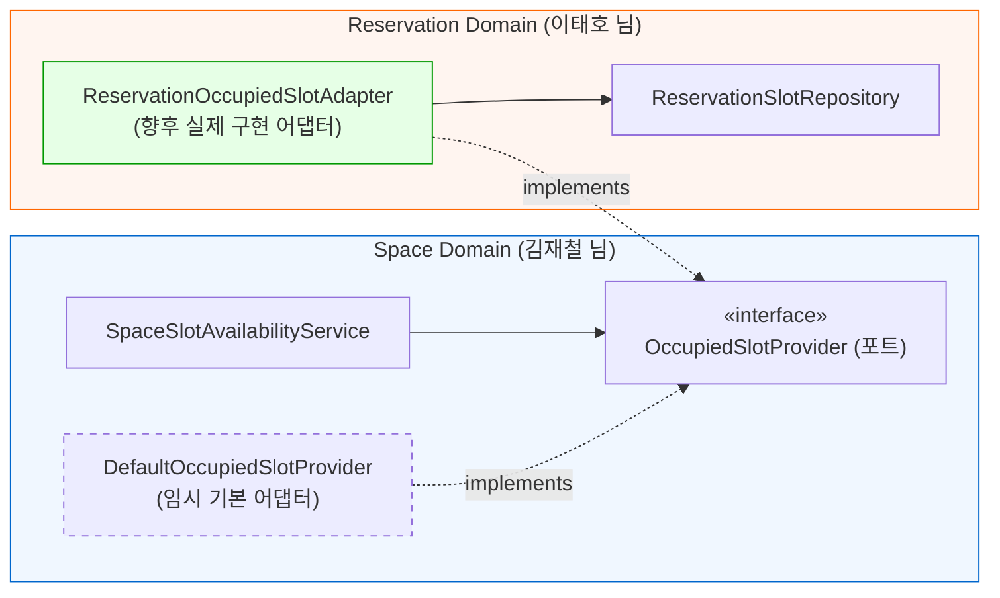

# 📌 신규 서비스/컴포넌트 상세 가이드

본 문서는 `space` 도메인 개발 과정에서 완전히 새롭게 추가된 **`OccupiedSlotProvider`** 인터페이스와 기본 구현체인 **`DefaultOccupiedSlotProvider`**의 **도입 배경, 설계 의도, 동작 원리 및 향후 연동 방법**을 정리한 가이드입니다. 처음 코드를 읽는 팀원도 쉽게 이해하고 활용할 수 있도록 작성되었습니다.

---

## 1. 한눈에 보는 요약 (TL;DR)

- **위치**: `com.ovengers.slotkey.space.service`
- **역할**: "특정 공간과 날짜에 대해 이미 예약된 30분 슬롯들의 시작 시각 목록(`Set<LocalDateTime>`)을 조회"하는 창구.
- **핵심 목적**:
  1. 공간 도메인이 **아직 구현 중인 예약 도메인에 강하게 결합되지 않도록 격리** (의존성 역전 / 헥사고날 포트-어댑터 패턴).
  2. 예약 도메인의 완성 여부와 관계없이 **공간 도메인이 100% 독립적으로 빌드, 실행, 단위 테스트**될 수 있도록 보장.
  3. 향후 예약 도메인이 완성되었을 때 **기존 공간 도메인 코드를 단 1줄도 수정하지 않고** 실제 DB 조회 어댑터로 즉시 교체 가능.

---

## 2. 도입 배경 및 문제 상황 (Why was it needed?)

### 1) 요구사항
- `GET /api/spaces/{spaceId}/slots?date=YYYY-MM-DD` API는 특정 날짜의 30분 단위 슬롯 가용성 스냅샷을 반환해야 합니다.
- 이때, **이미 다른 사용자가 예약한 슬롯**은 `isAvailable: false`로 표시되어야 합니다.

### 2) 개발 당시의 문제점
- "어떤 슬롯이 이미 예약되었는가?"는 `reservation_slot` 테이블의 데이터를 조회해야 합니다.
- 그러나 `reservation_slot` 엔티티와 리포지토리는 **예약 도메인(이태호 님)** 담당이며, 당시 아직 스켈레톤(빈 인터페이스) 상태였습니다.
- 만약 `SpaceSlotAvailabilityService`가 미완성된 예약 리포지토리를 직접 주입받아 쓰려고 했다면:
  1. **빌드 실패**: 메서드 시그니처가 없어 컴파일조차 되지 않음.
  2. **협업 병목**: 예약 도메인 담당자의 작업이 끝날 때까지 공간 도메인의 슬롯 조회 기능 개발과 테스트가 전면 중단됨.
  3. **도메인 강결합**: 공간 패키지가 예약 패키지의 내부 구현(JPA 엔티티, 테이블 구조)을 직접 알게 되어, 예약 쪽 코드가 조금만 바뀌어도 공간 쪽이 함께 깨짐.

---

## 3. 해결책: 포트 & 어댑터 패턴 (Port and Adapter Pattern)

이 문제를 해결하기 위해 객체지향 설계 5대 원칙 중 **DIP(의존성 역전 원칙)**와 **포트-어댑터 패턴**을 적용했습니다.



1. **포트 (Port)**: `Space` 도메인 입장에서 필요한 계약(Contract)만을 정의한 인터페이스 (`OccupiedSlotProvider`).
2. **어댑터 (Adapter)**:
   - **현재**: 빈 Set을 반환하는 임시 구현체 (`DefaultOccupiedSlotProvider`).
   - **향후**: 실제 `reservation_slot` 테이블을 조회하는 어댑터 (`ReservationOccupiedSlotAdapter`).

---

## 4. 클래스 상세 설명

### 1) `OccupiedSlotProvider.java` (인터페이스 / Port)

```java
package com.ovengers.slotkey.space.service;

import java.time.LocalDate;
import java.time.LocalDateTime;
import java.util.Set;

public interface OccupiedSlotProvider {
    /**
     * 특정 공간(spaceId)과 날짜(date)에 점유된 슬롯의 시작 시각(slotStart) 목록을 반환합니다.
     */
    Set<LocalDateTime> getOccupiedSlotStarts(Long spaceId, LocalDate date);
}
```
- **특징**: JPA나 Entity를 전혀 노출하지 않고, 오직 `Set<LocalDateTime>`이라는 순수한 자바 표준 시간 타입만 반환합니다. 이로써 두 도메인 간의 의존성이 완벽히 분리됩니다.

### 2) `DefaultOccupiedSlotProvider.java` (기본 어댑터 / Default Adapter)

```java
package com.ovengers.slotkey.space.service;

import org.springframework.boot.autoconfigure.condition.ConditionalOnMissingBean;
import org.springframework.stereotype.Component;

import java.time.LocalDate;
import java.time.LocalDateTime;
import java.util.Collections;
import java.util.Set;

@Component
@ConditionalOnMissingBean(type = "ReservationOccupiedSlotAdapter")
public class DefaultOccupiedSlotProvider implements OccupiedSlotProvider {

    @Override
    public Set<LocalDateTime> getOccupiedSlotStarts(Long spaceId, LocalDate date) {
        // 예약 도메인 연계 전 기본 구현: 점유된 슬롯 없음(빈 Set 반환)
        return Collections.emptySet();
    }
}
```
- **`@ConditionalOnMissingBean`**: 스프링 컨테이너에 실제 예약 어댑터 빈이 등록되지 않았을 때만 활성화됩니다.
- **효과**: 개발 초기나 로컬 환경에서 예약 데이터베이스나 관련 로직이 없어도 공간 슬롯 조회 API가 에러 없이 200 OK로 동작합니다.

---

## 5. 단위 테스트에서의 장점

이 포트 구조 덕분에 [SpaceSlotAvailabilityServiceTest.java](file:///Users/mac/IdeaProjects/NBE12-14-2-OVENGERS/backend/src/test/java/com/ovengers/slotkey/space/service/SpaceSlotAvailabilityServiceTest.java)에서 무거운 DB나 타 도메인 객체 없이 가볍게 모킹(Mock)할 수 있습니다:

```java
// Mockito를 이용해 "11:00 슬롯이 이미 예약된 상황"을 단 1줄로 세팅
LocalDateTime occupiedTime = LocalDateTime.of(2026, 9, 20, 11, 0);
given(occupiedSlotProvider.getOccupiedSlotStarts(spaceId, targetDate))
        .willReturn(Set.of(occupiedTime));

// 검증: 11:00 슬롯만 isAvailable: false로 정확히 반환되는지 확인
SpaceSlotAvailabilityResponse response = availabilityService.getSlotAvailability(spaceId, targetDate);
assertThat(response.slots().get(4).isAvailable()).isFalse();
```

---

## 6. 향후 예약 도메인 연동 가이드 (연동 시 개발자가 할 일)

추후 예약 도메인 담당자(이태호 님)가 `ReservationSlotRepository` 개발을 완료하면, 연동을 위해 **공간 도메인 코드를 수정할 필요가 전혀 없습니다**.

다음과 같이 예약 도메인 패키지에 어댑터 클래스 1개만 작성해 주면 끝납니다:

```java
package com.ovengers.slotkey.reservation.adapter;

import com.ovengers.slotkey.reservation.entity.ReservationSlot;
import com.ovengers.slotkey.reservation.repository.ReservationSlotRepository;
import com.ovengers.slotkey.space.service.OccupiedSlotProvider;
import lombok.RequiredArgsConstructor;
import org.springframework.stereotype.Component;

import java.time.LocalDate;
import java.time.LocalDateTime;
import java.util.Set;
import java.util.stream.Collectors;

@Component("ReservationOccupiedSlotAdapter") // 이 이름으로 빈이 등록되면 DefaultOccupiedSlotProvider가 자동 비활성화됨
@RequiredArgsConstructor
public class ReservationOccupiedSlotAdapter implements OccupiedSlotProvider {

    private final ReservationSlotRepository reservationSlotRepository;

    @Override
    public Set<LocalDateTime> getOccupiedSlotStarts(Long spaceId, LocalDate date) {
        LocalDateTime startOfDay = date.atStartOfDay();
        LocalDateTime endOfDay = date.atTime(23, 59, 59);

        // 해당 공간의 특정 일자에 점유된 슬롯 조회
        List<ReservationSlot> slots = reservationSlotRepository
                .findAllBySpaceIdAndSlotStartBetween(spaceId, startOfDay, endOfDay);

        return slots.stream()
                .map(ReservationSlot::getSlotStart)
                .collect(Collectors.toSet());
    }
}
```

이렇게 하면 `@ConditionalOnMissingBean` 조건에 의해 `DefaultOccupiedSlotProvider`는 자동으로 비활성화되고, 새로운 `ReservationOccupiedSlotAdapter`가 `SpaceSlotAvailabilityService`에 자연스럽게 주입되어 실제 예약 DB 데이터와 실시간 연동됩니다.

