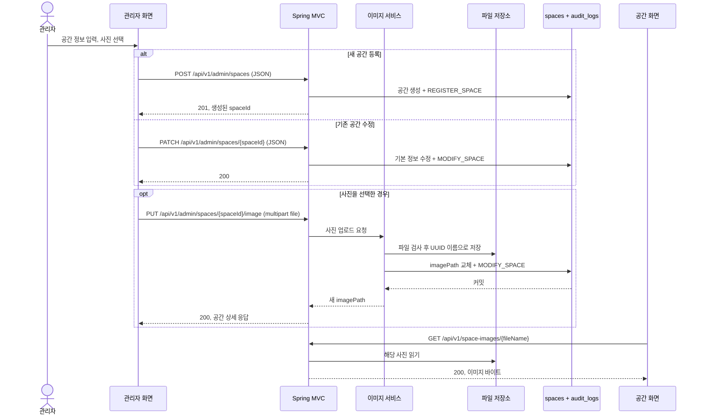

# 관리자 공간 대표 사진: 등록·교체와 조회

이 문서는 **현재 구현된 단일 대표 사진**의 사용 방법과 프론트엔드 → Spring MVC → 파일·DB 저장 흐름을 설명한다. 지원 형식은 현재 코드 기준 JPEG/PNG이며 WebP는 지원하지 않는다.

## 한눈에 보기

관리자는 공간 정보를 저장한 다음 사진을 올린다. 등록과 수정 모두 **공간 정보 요청과 사진 요청이 별개**다. 사진의 실제 바이트는 서버 파일 저장소에 있고, `spaces.image_path`에는 브라우저가 조회할 상대 URL만 기록된다.

등록 화면은 POST 응답의 `id`로 PUT을 보낸다. 수정 화면은 현재 공간 ID로 PATCH 후 PUT을 보낸다. **사진을 고르지 않으면 PUT은 보내지 않는다.** 성공한 사진은 공개 공간 카드·상세와 관리자 수정 화면에서 `imagePath`를 통해 표시된다. 사진이 없거나 읽기에 실패하면 화면은 “공간 사진 준비 중” 대체 표시를 사용한다.

## 사용자에게 보이는 동작

- 파일 선택은 JPG/JPEG 또는 PNG, **5 × 1024 × 1024바이트 이하**만 허용한다. 서버는 파일 서명과 실제 이미지, 가로·세로 각각 최대 **4096px**도 검사한다. WebP는 지원하지 않는다.
- 공간 등록 후 사진 PUT만 실패해도 **공간은 이미 생성된 상태**다. 수정에서 PUT만 실패해도 **기본 정보 PATCH는 이미 반영된 상태**다. 화면의 실패 패널은 이 부분 성공을 알리고, 같은 공간 ID로 원래 사진을 재시도하거나 다른 유효 사진을 골라 **PUT만** 보낸다. 재시도 때문에 등록 POST나 기본 정보 PATCH를 반복하지 않는다.
- 실패 패널에서 무효 파일을 고르면 이전 대체 사진 선택도 해제된다. 수정 화면의 “기본 정보 계속 수정”은 최신 상세 GET을 다시 받아 일반 폼을 열며, 이전 실패 사진은 자동 선택하지 않는다.
- 이는 별도 HTTP 요청 둘의 흐름이므로, 사진 실패를 공간 등록·수정 전체의 자동 롤백으로 해석하면 안 된다.

## 개발자를 위한 현재 계약

| 역할 | 현재 경로·동작 |
| --- | --- |
| 공간 등록 | `POST /api/v1/admin/spaces` — JSON, 성공 `201`; 응답 `data.id`를 사진 PUT에 사용 |
| 기본 정보 수정 | `PATCH /api/v1/admin/spaces/{spaceId}` — JSON, 성공 `200` |
| 대표 사진 등록·교체 | `PUT /api/v1/admin/spaces/{spaceId}/image` — 관리자 권한, `multipart/form-data`의 `file` 필드, 성공 `200`과 새 `data.imagePath` |
| 사진 조회 | `GET /api/v1/space-images/{fileName}` — 공개 GET, 실제 이미지 바이트와 MIME 반환 |

POST/PATCH의 JSON 본문에 비어 있지 않은 `imagePath`를 직접 보내면 400 `VALIDATION_FAILED`다. `imagePath`는 서버가 만든 `/api/v1/space-images/{UUID}.jpg` 또는 `.png` 형태이며, 기존 샘플의 `/images/...` 경로도 조회용 데이터로 남을 수 있다. `/api/v1/admin/**`는 관리자 전용이고 사진 GET만 공개된다. 더 자세한 오류 코드·헤더는 [HTTP API 명세](api-spec.md)를 본다.

프론트엔드는 [`SpaceForm`](../frontend/src/components/space/SpaceForm.tsx) → [`AdminSpaceFormPage`](../frontend/src/views/admin/AdminSpaceFormPage.tsx) → [`adminSpaceApi`](../frontend/src/api/adminSpaceApi.ts) 순서로 파일을 전달한다. 로컬 Next.js는 `/api/v1/*`를 백엔드로 rewrite한다. 백엔드는 [`AdminSpaceController`](../backend/src/main/java/com/ovengers/slotkey/space/controller/AdminSpaceController.java)의 MVC multipart 바인딩, [`SpaceImageService`](../backend/src/main/java/com/ovengers/slotkey/space/service/SpaceImageService.java)의 파일·DB 조정, [`AdminSpaceImageUpdateService`](../backend/src/main/java/com/ovengers/slotkey/space/service/AdminSpaceImageUpdateService.java)의 경로 교체·감사 로그 트랜잭션, [`SpaceImageController`](../backend/src/main/java/com/ovengers/slotkey/space/controller/SpaceImageController.java)의 파일 GET으로 나뉜다.

파일과 DB는 하나의 원자 트랜잭션이 아니다. 구현은 DB 갱신 실패 시 새 파일을 정리하고, 성공 후 이전 **서버 관리** 파일을 정리한다. 사진 변경 자체는 가격 비교용 `Space.version`을 올리지 않는다. 저장 위치는 `SPACE_IMAGE_STORAGE_ROOT`로 설정하며 로컬 기본값은 `./data/space-images`다. 운영 배포의 영속 볼륨과 `/api/*` 프록시·CDN 라우팅은 별도로 구성·검증해야 한다.

## 검증 범위

등록·수정 화면의 기본 업로드는 각각 POST/PATCH → PUT 200, 새 `imagePath`의 이미지 GET 200과 화면 표시까지 로컬 스모크에서 확인했다. 백엔드 자동 검증은 [저장 계층 테스트](../backend/src/test/java/com/ovengers/slotkey/space/image/SpaceImageStorageTest.java), [이미지 서비스 통합 테스트](../backend/src/test/java/com/ovengers/slotkey/space/service/AdminSpaceImageServiceIntegrationTest.java), [조회 컨트롤러 테스트](../backend/src/test/java/com/ovengers/slotkey/space/controller/SpaceImageControllerTest.java)에서 확인할 수 있다. 로컬 스모크 실행 기록은 Git에서 추적하지 않는 작업 산출물에만 있다. 실패 재시도·중복 조작의 일부 세부 조합과 운영 스토리지는 **기본 기능 합격과 별도**이며, 모든 경계 사례가 실측 완료됐다는 뜻은 아니다.
