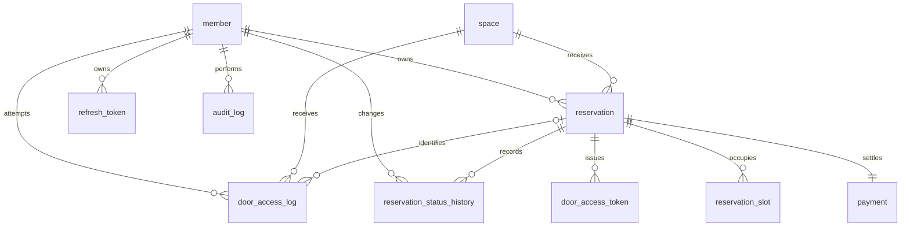

# ERD 및 데이터 모델

> 출처: 기획서 6-1, `데이터모델-아키텍처-결정.md`. 30분 슬롯 통일(항목 1), door_access_token 유니크 제약(항목 2), audit_log 복합 인덱스(항목 4) 반영본.

## 엔터티 및 담당자

| 엔터티 | 담당자 | 주요 필드 | 역할 |
| --- |-----| --- | --- |
| `member` | 천종원 | id, email, password_hash, nickname, role, status, created_at | 회원/관리자. role: MEMBER / PLATFORM_ADMIN. status: ACTIVE / SUSPENDED |
| `refresh_token` | 천종원 | id, member_id, token_hash, issued_at, expires_at, revoked_at | 로그인 재발급 토큰. 원문 대신 해시 저장, 재발급 시 회전 |
| `space` | 김재철 | id, name, location, description, capacity, price_per_slot, image_path, opening_time, closing_time, status | 관리자가 등록하는 예약 대상 공간. `price_per_slot`은 100원 단위, 30분당 고정 요금 |
| `audit_log` | 김재철 | id, actor_member_id, action, target_type, target_id, reason, before_value, after_value, created_at | 관리 작업(공간 등록/수정, 회원 정지/복구, 강제취소) 기록. `(target_type, target_id)` 복합 인덱스 |
| `reservation` | 이태호 | id, member_id, space_id, start_time, end_time, status, price_per_slot_snapshot, total_amount, cancelled_at, completed_at, created_at | status: CONFIRMED / CANCELLED / COMPLETED. 슬롯 확보+Mock 결제 성공 시 대기 상태 없이 즉시 CONFIRMED |
| `reservation_slot` | 이태호 | id, reservation_id, space_id, slot_start | 예약이 확보한 30분 단위 시간. `UNIQUE(space_id, slot_start)`로 중복 점유 방지 |
| `payment` | 백한비 | id, reservation_id, amount, status, paid_at, cancelled_at | 예약당 결제 1건. `UNIQUE(reservation_id)`. status: SUCCESS / CANCELLED |
| `reservation_status_history` | 백한비 | id, reservation_id, changed_by_member_id, from_status, to_status, reason, changed_at | 상태 변경 이력. 최초 생성의 from_status는 NULL, 시스템 작업은 changed_by_member_id NULL 허용 |
| `door_access_token` | 박창현 | id, reservation_id, token_hash, issued_at, revoked_at, revoke_reason, active_reservation_id | `active_reservation_id`는 `revoked_at IS NULL`일 때만 값을 갖는 생성 컬럼 + `UNIQUE` → 예약당 활성 토큰 최대 1개를 DB 레벨로 강제 |
| `door_access_log` | 박창현 | id, actor_member_id, reservation_id, requested_space_id, result, reason_code, attempted_at | 출입 검증 결과. result: ALLOW / DENY. 식별 불가 대상은 NULL 허용 |

## 관계

```
Member 1 --- N Reservation
Member 1 --- N RefreshToken
Member 1 --- N ReservationStatusHistory : 변경 수행자
Member 1 --- N DoorAccessLog : 출입 요청자
Member 1 --- N AuditLog : 관리 작업 수행자

Space 1 --- N Reservation
Space 1 --- N DoorAccessLog : 출입 요청 공간

Reservation 1 --- 1 Payment
Reservation 1 --- N ReservationSlot
Reservation 1 --- N ReservationStatusHistory
Reservation 1 --- N DoorAccessToken
Reservation 1 --- N DoorAccessLog : 확인된 예약
```



## 가격/슬롯 규칙 (결정 항목 1)

- 예약 최소 단위는 30분으로 통일. `space.price_per_slot`은 30분당 정액 요금(100원 단위).
- `reservation.price_per_slot_snapshot`은 예약 확정 시점의 요금 스냅샷. `total_amount = price_per_slot_snapshot × 점유 슬롯 수`.
- 공간 요금이 바뀌어도 이미 확정된 예약의 스냅샷/총액은 바뀌지 않는다.

## 출입 토큰 유일성 (결정 항목 2)

- `door_access_token`에 `active_reservation_id`(생성 컬럼)를 두고 `UNIQUE(active_reservation_id)` 적용.
- MySQL 유니크 인덱스는 NULL을 여러 개 허용하므로, 폐기된 토큰 이력은 자유롭게 쌓이고 "현재 유효한 토큰은 예약당 1개"만 DB가 강제.
- 재발급(재입장) 시나리오: 새 토큰 발급 전 기존 활성 토큰을 먼저 폐기(`revoked_at` 세팅)하는 트랜잭션으로 처리.
