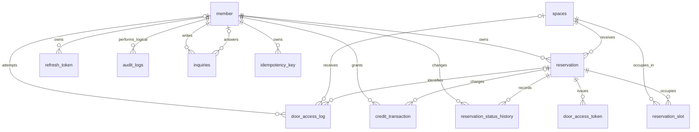

# ERD 및 데이터 모델

> 출처: 기획서 6-1, `데이터모델-아키텍처-결정.md`. 30분 슬롯 통일(항목 1), door_access_token 유니크 제약(항목 2), audit_logs 복합 인덱스(항목 4) 반영본.
> **2026-09-24 갱신**: Flyway V1~V10 전수 대조를 바탕으로 V7 `idempotency_key`, V10 `inquiries`의 테이블·관계·인덱스를 ERD에 추가하고, V4 `payment`의 미생성(빈 마이그레이션 유지) 상태와 담당자 배정 사실(작성 시점 기록과 현재 구현 사실 분리)을 정비했다.

## 엔터티 및 담당자

| 엔터티 | 담당자 | 주요 필드 | 역할 |
| --- |-----| --- | --- |
| `member` | 천종원 | id, email, password_hash, nickname, role, status, **balance**, created_at | 회원/관리자. role: USER / ADMIN. status: ACTIVE / SUSPENDED / WITHDRAWN. **balance**: 크레딧 잔액(int, NOT NULL, DEFAULT 0) — 이용 한도, 결제 수단 아님 |
| `refresh_token` | 천종원 | id, member_id, token_hash, expires_at, revoked_at | 로그인 재발급 토큰. 원문 대신 해시 저장, 재발급 시 검증 후 새 Access Token 발급 (회전은 미구현) |
| `spaces` | 김재철 | id, name, location, description, capacity, price_per_slot, image_path, opening_time, closing_time, status, **version** | 관리자가 등록하는 예약 대상 공간. `price_per_slot`은 100원 단위, 30분당 고정 요금. `opening_time`/`closing_time`은 30분 경계인 `TIME`(LocalTime) — "매일 반복되는 규칙"이므로 날짜 없음. **version**: 가격 등 변경에 대한 낙관적 비교용(int) |
| `audit_logs` | 김재철 | id, actor_member_id, action, target_type, target_id, reason, before_value, after_value, created_at | 관리 작업(공간 등록/수정, 회원 정지/복구, 강제취소, 크레딧 지급) 기록. 인덱스: `(target_type, target_id)`, V9 `idx_audit_logs_created_id (created_at, id)` |
| `reservation` | 이태호 | id, member_id, space_id, start_time, end_time, status, price_per_slot_snapshot, total_amount, **hold_expires_at**, **checked_in_at**, **checked_out_at**, cancelled_at, created_at | status: `HELD`/`EXPIRED`/`CONFIRMED`/`IN_USE`/`COMPLETED`/`CANCELLED`/`NO_SHOW` (7개). 슬롯 확보 시 `HELD` 생성(`hold_expires_at`=+10분) → Mock 결제 성공 시 `CONFIRMED` (2단계 플로우). ~~completed_at~~은 제거되어 `checked_out_at`으로 통합(체크아웃 시각 = 완료 시각) |
| `reservation_slot` | 이태호 | id, reservation_id, space_id, slot_start | 예약이 확보한 30분 단위 시간. **살아있는 점유일 때만 존재**(취소/노쇼/만료 시 하드 삭제). `UNIQUE(space_id, slot_start)`로 중복 점유 방지 |
| `credit_transaction` | 초기 분담: 미정 (구 `payment` 백한비 영역, V6 파일상 '담당: 미정' 기록; 실제 작성·현재 유지보수 담당 미확인) | id, member_id, amount, type, reservation_id, balance_after, reason, created_at | **크레딧 원장(단일 진실)** — `payment` 테이블을 대체. `amount`는 부호 있음(지급/환급 +, 차감/위약금 -)이며 `SUM(amount) = member.balance`. `type`: SIGNUP_GRANT / ADMIN_GRANT / RESERVATION_CHARGE / REFUND / PENALTY. `reservation_id`는 지급 건일 경우 NULL. `reason`은 ADMIN_GRANT만 필수. `INDEX(member_id, created_at)` |
| `reservation_status_history` | 초기 분담: 백한비 / 실제 작성: 이태호 (V3 파일 비고에 '백한비님 대신 이태호가 작성' 명시) | id, reservation_id, changed_by_member_id, from_status, to_status, reason, changed_at | 상태 변경 이력. 최초 생성의 from_status는 NULL, 시스템 작업은 changed_by_member_id NULL 허용. 성공한 전이만 기록 |
| `door_access_token` | 박창현 | id, reservation_id, token_hash, issued_at, revoked_at, revoke_reason, active_reservation_id | `active_reservation_id`는 `revoked_at IS NULL`일 때만 값을 갖는 생성 컬럼 + `UNIQUE` → 예약당 활성 토큰 최대 1개를 DB 레벨로 강제 (변경 없음, §11 "유지") |
| `door_access_log` | 박창현 | id, actor_member_id, reservation_id, requested_space_id, result, reason_code, attempted_at | 출입 검증 결과. result: ALLOW / DENY. 식별 불가 대상은 NULL 허용. 세 컬럼 모두 DB 레벨 FK (`fk_door_access_log_actor_member`, `fk_door_access_log_requested_space`, `fk_door_access_log_reservation`) |
| `idempotency_key` | 이태호 (V7 작성 및 서비스 구현) | id, idempotency_key, member_id, request_path, response_status, response_body, created_at | 결제 멱등성 보장용(성공 응답 캐싱 및 동일 키 재요청 시 재생). `UNIQUE(idempotency_key, member_id, request_path)` |
| `inquiries` | 이태호 (초기 분담표 미기재, 2026-09-23 V10 작성 및 구현) | id, member_id, title, content, status, answer_content, answered_by_member_id, answered_at, created_at, updated_at | 회원 문의(Q&A) + 관리자 답변. 문의 1건당 답변 1건(1:1)으로 단순화 — 재질문/스레드형 재답변은 범위 밖. status: WAITING / ANSWERED. MVP 3대 기능 외 추가 구현 기능 |

> ~~`payment`~~ 테이블은 **애초에 생성하지 않고(V4 파일은 빈 마이그레이션으로 유지)** 결제 내역은 `credit_transaction` 원장으로 단일화한다.

## 관계

```
Member 1 --- N Reservation (DB FK: member_id)
Member 1 --- N RefreshToken (DB FK: member_id)
Member 1 --- N CreditTransaction (DB FK: member_id)
Member 1 --- N ReservationStatusHistory : 변경 수행자 (DB FK: changed_by_member_id, NULL 허용)
Member 0..1 --- N DoorAccessLog : 출입 요청자 (DB FK: actor_member_id, V5 fk_door_access_log_actor_member, NULL 허용)
Member 1 --- N AuditLog : 관리 작업 수행자 (논리적 참조: V2 actor_member_id에는 DB FK 제약 없음)
Member 1 --- N Inquiries : 문의 작성자 (DB FK: member_id)
Member 0..1 --- N Inquiries : 답변 관리자 (DB FK: answered_by_member_id, NULL 허용)
Member 1 --- N IdempotencyKey : 결제 멱등 키 소유자 (DB FK: member_id)

Space 1 --- N Reservation (DB FK: space_id)
Space 1 --- N ReservationSlot : 점유 대상 공간 (DB FK: space_id, V3 fk_reservation_slot_space)
Space 0..1 --- N DoorAccessLog : 출입 요청 공간 (DB FK: requested_space_id, V5 fk_door_access_log_requested_space, NULL 허용)

Reservation 1 --- N ReservationSlot (DB FK: reservation_id)
Reservation 1 --- N ReservationStatusHistory (DB FK: reservation_id)
Reservation 1 --- N DoorAccessToken (DB FK: reservation_id)
Reservation 0..1 --- N DoorAccessLog : 확인된 예약 (DB FK: reservation_id, V5 fk_door_access_log_reservation, NULL 허용)
Reservation 0..1 --- N CreditTransaction : 지급 건은 예약과 무관(NULL) (DB FK: reservation_id)
```



## 가격/슬롯 규칙 (결정 항목 1)

- 예약 최소 단위는 30분으로 통일. `spaces.price_per_slot`은 30분당 정액 요금(100원 단위).
- `reservation.price_per_slot_snapshot`은 예약 확정 시점의 요금 스냅샷. `total_amount = price_per_slot_snapshot × 점유 슬롯 수`.
- 공간 요금이 바뀌어도 이미 확정된 예약의 스냅샷/총액은 바뀌지 않는다.
- **가격 확인(낙관적 검증)은 `spaces.version`으로 한다** (가격 값 자체가 아니라 버전 비교 — ABA 문제 방지, §5-2).

## 출입 토큰 유일성 (결정 항목 2)

- `door_access_token`에 `active_reservation_id`(생성 컬럼)를 두고 `UNIQUE(active_reservation_id)` 적용.
- MySQL 유니크 인덱스는 NULL을 여러 개 허용하므로, 폐기된 토큰 이력은 자유롭게 쌓이고 "현재 유효한 토큰은 예약당 1개"만 DB가 강제.
- 재발급(재입장) 시나리오: 새 토큰 발급 전 기존 활성 토큰을 먼저 폐기(`revoked_at` 세팅)하는 트랜잭션으로 처리.

## 크레딧 원장 규칙 (core-domain-decisions.md §1)

- `payment` 테이블은 애초에 생성하지 않고(V4 빈 마이그레이션 유지), `credit_transaction` 원장으로 단일화. 1크레딧 = 1원(`int`), `spaces.price_per_slot`과 동일 단위.
- `amount`에 부호를 담아 `SUM(amount) = member.balance`가 성립해야 한다.
- 차등 환불(취소 시 50%)은 `REFUND +전액`과 `PENALTY -위약금`을 **두 줄로 분리 기록**한다(한 줄로 합치지 않음).
- 차감은 조건부 UPDATE(`WHERE balance >= :amount`)로 처리하며, 엔티티 dirty checking에 맡기지 않는다(갱신 유실 방지).

## 무결성 제약 (CHECK) — core-domain-decisions.md §11

```sql
-- reservation
CHECK (start_time < end_time)
CHECK (status <> 'HELD'      OR hold_expires_at IS NOT NULL)
CHECK (status <> 'CANCELLED' OR cancelled_at   IS NOT NULL)
CHECK (status <> 'COMPLETED' OR checked_out_at IS NOT NULL)
CHECK (status NOT IN ('IN_USE','COMPLETED') OR checked_in_at IS NOT NULL)

-- spaces
CHECK (opening_time < closing_time)          -- 자정 넘는 운영은 범위 밖

-- inquiries (V10)
CHECK (status <> 'ANSWERED' OR (answer_content IS NOT NULL AND answered_at IS NOT NULL))
```

## 확인됨 — 변경 없음 (core-domain-decisions.md §11 "확인" 항목)

- `spaces.opening_time` / `closing_time`은 `TIME`(LocalTime)이며 30분 경계로 검증한다.
- `reservation_slot`은 이미 "살아있는 점유일 때만 존재"하도록 설계되어 있으며(취소/노쇼/만료 시 하드 삭제), `UNIQUE(space_id, slot_start)`도 유지된다. 추가 변경 없음.
- `door_access_token.active_reservation_id` UNIQUE 제약은 그대로 유지된다.
- `idempotency_key`의 `UNIQUE(idempotency_key, member_id, request_path)` 제약은 그대로 유지된다.

## 2026-09-15 ~ 2026-09-24 변경 이력 (core-domain-decisions.md §11 및 V1~V10 반영)

| 구분 | 대상 | 상태 |
| --- | --- | --- |
| 미생성 | `payment` 테이블 전체 | 반영 완료 (ERD에서 제거). DDL상 `payment` 테이블이 애초에 생성된 적이 없고(V4 빈 마이그레이션 유지) `credit_transaction` 원장으로 단일화됨 |
| 추가 | `member.balance` (int, NOT NULL, DEFAULT 0) | ERD + `V1` DDL 반영 완료 (`member` 테이블 생성 시 컬럼 포함) |
| 추가 | `credit_transaction` 테이블 | ERD 반영 + `V6__create_credit_transaction_table.sql` 신규 작성 완료 |
| 추가 | `reservation.hold_expires_at` (datetime, NULL 허용) | ERD + `V3` DDL 반영 완료 |
| 추가 | `reservation.checked_in_at`, `checked_out_at` | ERD + `V3` DDL 반영 완료 |
| 추가 | `spaces.version` (int) | ERD 반영 완료 (당시 `V2` DDL상 `space.version`으로 추가되었으며 이후 V8에서 테이블명 rename) |
| 변경 | `reservation.status` enum → 7개 | ERD 반영 완료. 컬럼 타입(VARCHAR(20))은 기존과 동일, 허용 값만 애플리케이션에서 확장 |
| 변경 | `reservation.completed_at` 제거 → `checked_out_at`으로 통합 | ERD + `V3` DDL 반영 완료 |
| 확인 | `spaces.opening_time`/`closing_time` = TIME | 30분 경계 검증 적용 |
| 변경 | `space` → `spaces` | `V8__rename_space_to_spaces.sql`로 실제 테이블명 변경 |
| 확인 | `reservation_slot` 존재 조건, UNIQUE 제약 | 변경 없음 확인 |
| 유지 | `door_access_token.active_reservation_id` UNIQUE | 변경 없음 |
| 추가 | `idempotency_key` 테이블 | ERD 반영 + `V7__create_idempotency_key_table.sql`로 결제 멱등성 보장(성공 응답 캐싱) 추가 |
| 추가 | `idx_audit_logs_created_id (created_at, id)` | `V9__add_audit_logs_created_at_id_index.sql`로 감사 로그 정렬·날짜 필터 최적화 복합 인덱스 추가 |
| 추가 | `inquiries` 테이블 | ERD 반영 + `V10__create_inquiry_table.sql`로 회원 Q&A 및 관리자 답변 테이블 추가 |

### 이번 반영에서 함께 발견/수정한 모순

- **[수정] 테이블명 정합화**: V2~V5에서 사용하던 `space` 테이블은 V8에서 `spaces`로 rename되며, 엔티티와 현재 FK는 `spaces`를 사용한다.
- **[구현 완료 및 정리] 마이그레이션 상태**: V1(`member`, `refresh_token`), V2(`space`, `audit_logs`), V3(`reservation`, `reservation_slot`, `reservation_status_history`), V5(`door_access_token`, `door_access_log`), V6(`credit_transaction`), V7(`idempotency_key`), V8(`rename`), V9(`index`), V10(`inquiries`)은 정상 구현 완료되었으며, V4(`payment`)는 결제가 크레딧 원장(V6 `credit_transaction`)으로 단일화되어 의도적으로 빈 마이그레이션으로 유지된다.
- `audit_logs`는 감사 로그 엔티티의 실제 테이블명이며, 이 문서도 동일한 이름을 사용한다.
