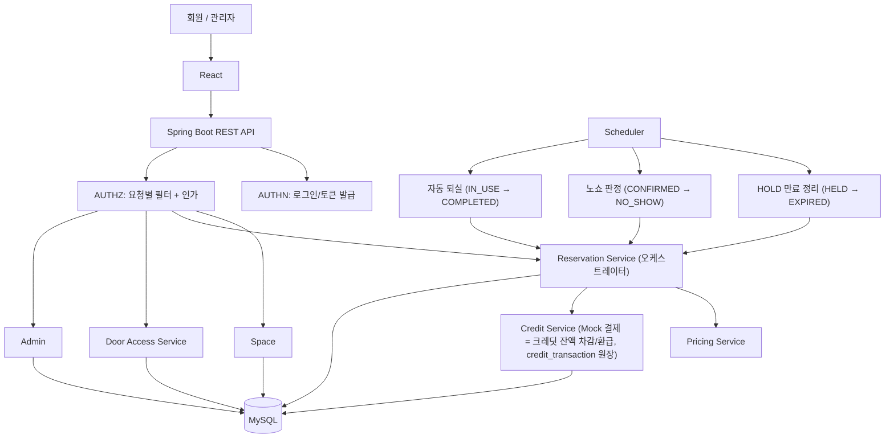

# 시스템 아키텍처

> 출처: 기획서 5장, `데이터모델-아키텍처-결정.md` 항목 3(오케스트레이션 방향), 항목 4(경미한 결정).
> **2026-09-15 갱신**: `docs/core-domain-decisions.md` 반영 — `payment`/외부 Mock PG 개념 삭제, 크레딧 원장(`credit_transaction`)으로 단일화. Scheduler 책임 확장(HOLD 만료, 노쇼, 자동 퇴실). 결제 실패/취소 보상 처리 설명을 §2/§6-2 기준으로 정정.

## 기술 스택 (5-1)

| 영역 | 기술 | 비고 |
| --- | --- | --- |
| 백엔드 | Spring Boot 3.x, Spring Security 6.x, Spring Data JPA | 도메인별로 서비스 분리 |
| DB | MySQL, Testcontainers 통합 테스트 | 유니크 제약·트랜잭션으로 동시성 검증 |
| 프론트엔드 | React | 조회·예약·결제 확인·출입 검증 최소 화면 |
| 인프라/배포 | Railway(백엔드·MySQL) 또는 AWS EC2, Vercel(프론트엔드) | README 기준 배포 대상은 팀 결정에 따라 갱신 |
| CI/CD | GitHub Actions, Swagger UI | 빌드·테스트 자동화, API 문서 |

## 전체 흐름 (5-2)

```
사용자
→ React 화면
→ Spring Boot REST API
→ 인증(AUTHN) 및 요청 자원에 대한 권한 확인(AUTHZ)
→ 도메인별 업무 처리
→ MySQL 조회·저장
→ 공통 응답 형식으로 결과 반환
```



- **오케스트레이션 방향**: 예약 확정(결제) 트랜잭션에서 화살표는 `RES --> CREDIT`이다. Reservation Service가 슬롯 확보(HOLD) → 결제 확인 페이지 → 크레딧 차감 → 예약 확정을 조율하는 오케스트레이터이며, Credit(구 Payment)이 Reservation을 부르는 구조가 아니다. (2026-09-08 결정, 이전 다이어그램의 `PAY --> RES`는 오기. 2026-09-15: 노드명을 `Payment Service + Mock PG` → `Credit Service`로 변경 — 외부 PG 연동이 처음부터 없었고, `payment` 테이블도 삭제되어 크레딧 원장(`credit_transaction`)만 남았으므로 "게이트웨이" 뉘앙스를 걷어냄.)
- **AUTHN / AUTHZ 분리**: 로그인·토큰 발급(AUTHN)과 매 요청의 토큰 검증+도메인별 인가(AUTHZ)는 책임이 다르므로 컴포넌트를 분리한다.
- **Scheduler**: 세 가지 배치를 담당한다 — ① 만료된 `HELD`를 `EXPIRED`로 정리(단, 이는 정합성의 보험일 뿐 유일한 방어선이 아니다. 예약 생성 시점에도 만료 HELD를 즉시 정리하므로 배치가 늦어도 신규 예약은 막히지 않는다) ② 시작+15분까지 미체크인인 `CONFIRMED`를 `NO_SHOW`로 전이(슬롯 반환, 환불 없음) ③ 종료 시각이 지난 `IN_USE`를 자동으로 `COMPLETED` 처리(`checked_out_at` = `end_time`, 배치 실행 시각이 아님). 출입 검증은 어떤 배치 결과도 그대로 믿지 않고 매 요청에서 현재 시각·예약 상태를 다시 확인한다(배치 지연 리스크 대응).
- 도메인은 하나의 Spring Boot 애플리케이션 안에서 패키지 단위로 분리하며, 별도의 결제 게이트웨이 서버를 두지 않는다(크레딧 차감은 애플리케이션 내부 로직).

## 학습 범위 밖 기술과 검증 계획 (5-3)

1. 역할·소유권·상태·시간을 조합한 인가 → `docs/decisions/authorization-policy.md` 참고
2. 동시 예약 제어 (MySQL 유니크 제약 + 트랜잭션, 분산 락 미도입) → `docs/decisions/reservation-concurrency.md` 참고
3. 조건부 상태 변경 (UPDATE 조건 + 영향받은 행 수로 성공 판단, 예: 종료된 `IN_USE`만 `COMPLETED`로, 만료된 `HELD`만 `EXPIRED`로 전이)
4. **크레딧 차감/환급의 원자성** (외부 PG 콜백이 없으므로 "승인 실패 시 트랜잭션 전체 롤백"은 그대로 유효하지만, 취소 시 환급은 더 이상 "실패 보상 처리"가 필요 없다 — 크레딧과 예약이 같은 DB·같은 트랜잭션에 있어 "취소는 성공했는데 환불은 실패한" 중간 상태가 구조적으로 존재하지 않는다. 외부 PG였다면 필요했을 재처리 큐 자리가 사라진다. `core-domain-decisions.md` §6-2 참고) *(2026-09-15 정정 — 기존 "취소 시 Mock 환불 + 실패 재처리 이력" 서술을 대체)*
5. 시간 경계 테스트 (`Clock`을 주입받아 체크인 시작·마감, HOLD 만료, 예약 종료의 직전/정확한 경계/직후를 고정 시각으로 테스트)
