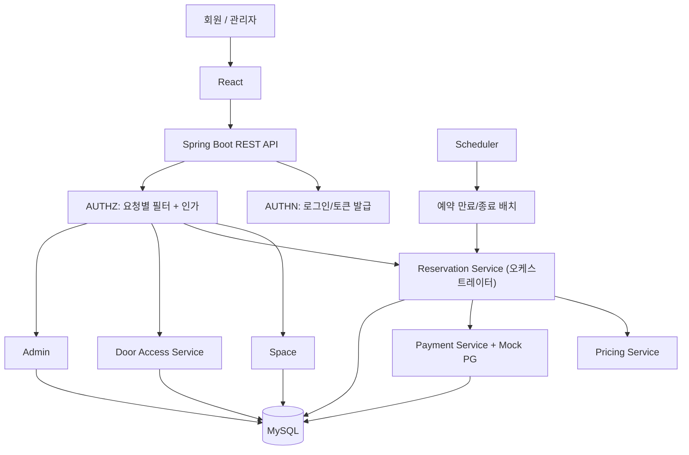

# 시스템 아키텍처

> 출처: 기획서 5장, `데이터모델-아키텍처-결정.md` 항목 3(오케스트레이션 방향), 항목 4(경미한 결정).

## 기술 스택 (5-1)

| 영역 | 기술 | 비고 |
| --- | --- | --- |
| 백엔드 | Spring Boot 3.x, Spring Security 6.x, Spring Data JPA | 도메인별로 서비스 분리 |
| DB | MySQL, Testcontainers 통합 테스트 | 유니크 제약·트랜잭션으로 동시성 검증 |
| 프론트엔드 | React | 조회·예약·Mock 결제·출입 검증 최소 화면 |
| 인프라/배포 | Railway(백엔드·MySQL) 또는 AWS EC2, Vercel(프론트엔드) | README 기준 배포 대상은 팀 결정에 따라 갱신 |
| CI/CD | GitHub Actions, Swagger UI | 빌드·테스트 자동화, API 문서 |

## 전체 흐름 (5-2)

```
사용자
→ React 화면
→ Spring Boot REST API
→ 인증(AUTHN) 및 요청 자원에 대한 권한 확인(AUTHZ)
→ 도메인별 업무 처리
→ MySQL 조회·저장
→ 공통 응답 형식으로 결과 반환
```



- **오케스트레이션 방향**: 예약 생성 트랜잭션에서 화살표는 `RES --> PAY`이다. Reservation Service가 슬롯 확보 → Mock 결제 승인 → 예약 확정을 조율하는 오케스트레이터이며, Payment가 Reservation을 부르는 구조가 아니다. (2026-09-08 결정, 이전 다이어그램의 `PAY --> RES`는 오기)
- **AUTHN / AUTHZ 분리**: 로그인·토큰 발급(AUTHN)과 매 요청의 토큰 검증+도메인별 인가(AUTHZ)는 책임이 다르므로 컴포넌트를 분리한다.
- **Scheduler**: 이용 시간이 종료된 `CONFIRMED` 예약을 배치로 `COMPLETED` 처리한다. 단, 출입 검증은 배치 결과만 믿지 않고 매 요청에서 현재 시각·예약 상태를 다시 확인한다(배치 지연 리스크 대응).
- 도메인은 하나의 Spring Boot 애플리케이션 안에서 패키지 단위로 분리하며, Mock PG를 별도 서버로 분리 배포하지 않는다.

## 학습 범위 밖 기술과 검증 계획 (5-3)

1. 역할·소유권·상태·시간을 조합한 인가 → `docs/decisions/authorization-policy.md` 참고
2. 동시 예약 제어 (MySQL 유니크 제약 + 트랜잭션, 분산 락 미도입) → `docs/decisions/reservation-concurrency.md` 참고
3. 조건부 상태 변경 (UPDATE 조건 + 영향받은 행 수로 성공 판단, 예: 종료된 CONFIRMED만 COMPLETED로 전이)
4. 결제 실패·취소 보상 처리 (승인 실패 시 트랜잭션 전체 롤백, 취소 시 Mock 환불 + 실패 재처리 이력)
5. 시간 경계 테스트 (`Clock`을 주입받아 체크인 시작·마감, 예약 종료의 직전/정확한 경계/직후를 고정 시각으로 테스트)
